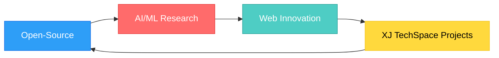

<div align="center">

# 👋 Hi, I'm Emmanuel Ayo Oyewo

### Full-Stack Developer | AI/ML Integration | Lead Developer @ XJ TechSpace


[](https://ayo.xjtechspace.com)
[](https://twitter.com/XBanTs_)
[](https://www.linkedin.com/in/ayomide-o-6b1130b1)
[](https://medium.com/@Ayo_Oyewo)

</div>

---

## 🚀 About Me

```javascript
const emmanuel = {
    role: "Lead Developer & Project Manager",
    company: "XJ TechSpace",
    focus: ["Full-Stack Development", "AI/ML Integration", "Open-Source"],
    currentlyBuilding: "Intelligent, user-centric digital products",
    philosophy: "Where innovation meets exceptional user experience"
};
```

I specialize in transforming complex problems into elegant, scalable solutions. From AI-powered recommendation systems to enterprise financial dashboards, I bridge the gap between cutting-edge technology and real-world business needs.

---

## 🛠️ Tech Arsenal

<div align="center">

### Frontend Magic ✨


### Backend Power ⚡


### AI/ML Intelligence 🤖


</div>

---

## 🎯 Featured Projects

<div align="center">
<table>
<tr>
<td width="50%">

### 📝 [BlogCraft](https://github.com/XBanTs/blogcraft)

**Crafting the future of content management**


**Modern blog CMS with advanced features:**

- 🔐 JWT auth + role-based access
- 📊 Real-time analytics dashboard  
- ✍️ Markdown editor with live preview
- 💾 Auto-save & writing analytics


**[🚀 Live Demo](https://blogcraft-xi.vercel.app/)** | **[📂 Code](https://github.com/XBanTs/blogcraft)**

</td>
<td width="50%">

### 📊 [DashFi](https://github.com/XBanTs/dashfi-frontend)

**Financial insights at your fingertips**


**Full-stack financial analytics platform:**

- 📈 Real-time KPI tracking
- 🔮 Predictive modeling & forecasting
- 📉 Interactive data visualization
- 🎨 Material-UI design system


**[🚀 Live Demo](https://dashfi-frontend.vercel.app/)** | **[📂 Code](https://github.com/XBanTs/dashfi-frontend)**

</td>
</tr>
</table>
</div>

---

<div align="center">

### 🎬 [Movie Recommendation API](https://github.com/XBanTs/recommendation-api)

**AI-powered personalized recommendations**


**Intelligent recommendation engine with:**

- 🤖 Collaborative filtering algorithm
- 🔄 Auto-retraining ML model
- ⭐ Real-time user rating system
- 🎯 Cosine similarity matching


**[📂 Repository](https://github.com/XBanTs/recommendation-api)** | **[📖 Documentation](https://github.com/XBanTs/recommendation-api#readme)**

</div>

---

## 📊 GitHub Stats

<div align="center">


</div>

---

## 🏆 What I Bring to the Table

<div align="center">

| 🎯 **Expertise**        | 💡 **Innovation**            | 🚀 **Execution**         |
|:-----------------------:|:----------------------------:|:------------------------:|
| Full-stack architecture | AI/ML integration            | Agile project management |
| RESTful API design      | Predictive analytics         | Clean, maintainable code |
| Database optimization   | NLP & recommendation systems | Performance optimization |
| UI/UX implementation    | Data visualization           | Continuous deployment    |

</div>

---

## 🌟 Current Focus



Currently diving deep into:

- 🔬 Advanced machine learning models for real-world applications
- 🌐 Next-gen web frameworks and serverless architectures
- 🤝 Contributing to impactful open-source projects
- 📚 Sharing knowledge through technical writing on Medium

---

## 📫 Let's Build Something Amazing Together

<div align="center">

**I'm always open to collaborating on innovative projects!**

[](mailto:ayomideoyewo@gmail.com)
[](https://ayo.xjtechspace.com)
[](https://twitter.com/XBanTs_)
[](https://www.linkedin.com/in/ayomide-o-6b1130b1)
[](https://medium.com/@Ayo_Oyewo)

---

### ⭐ Star my repos if you find them interesting!

<sub>💡 *"Code is poetry written in logic"* - Building the future, one commit at a time.</sub>

</div>
